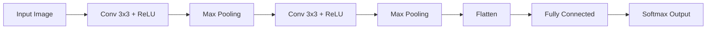

# Convolutional Neural Network (CNN)

This document describes the fundamentals of a **Convolutional Neural Network (CNN)** and demonstrates a **practical cybersecurity application** where network traffic is transformed into images and classified using a CNN.

---

## 1. Overview

A Convolutional Neural Network is a class of deep neural networks specifically designed to process data with a grid‑like topology, such as images or structured two‑dimensional representations. CNNs rely on three main ideas: **local receptive fields**, **parameter sharing**, and **hierarchical feature learning**. Instead of fully connecting every neuron to all inputs, CNNs use convolution kernels that slide across the input and learn spatial patterns such as edges, textures, or local correlations.

The standard CNN pipeline is composed of:
- Convolution layers
- Non‑linear activation functions (e.g., ReLU)
- Pooling layers
- Fully connected layers
- A softmax output layer for classification

---

## 2. CNN Architecture



Each convolution layer extracts increasingly abstract features. Early layers detect simple structures, while deeper layers encode more complex patterns.

---

## 3. Mathematical Intuition

For a 2‑D input X and kernel K, the convolution output Y is

Y(i,j) = sum_{m,n} X(i+m, j+n) · K(m,n)

Because the same kernel is reused across the entire input, the number of trainable parameters is significantly reduced compared to fully connected networks.

---

## 4. CNN in Cybersecurity – Practical Example

Below is a **single, self‑contained Python script** that:

1. Generates a cybersecurity traffic dataset
2. Converts traffic bytes into images
3. Trains a CNN
4. Evaluates the model
5. Generates and saves visualization images

All steps are combined into **one runnable program**, as requested.

---

## 5. Unified Source Code (Data + Model + Training + Evaluation + Visualizations)

```python
import numpy as np
import matplotlib.pyplot as plt
from sklearn.model_selection import train_test_split
from sklearn.metrics import confusion_matrix, ConfusionMatrixDisplay
import tensorflow as tf
from tensorflow.keras.models import Sequential
from tensorflow.keras.layers import Conv2D, MaxPooling2D, Flatten, Dense

# -------------------------------------------------------------
# 1. Synthetic cybersecurity dataset generation
# -------------------------------------------------------------

np.random.seed(42)

n_samples = 1000
bytes_per_flow = 1024

# Benign traffic
benign = np.random.normal(loc=120, scale=25, size=(500, bytes_per_flow))

# Malicious traffic
malicious = np.random.normal(loc=160, scale=30, size=(500, bytes_per_flow))

X = np.vstack((benign, malicious))
y = np.array([0] * 500 + [1] * 500)

X = np.clip(X, 0, 255).astype(np.uint8)

# -------------------------------------------------------------
# 2. Network traffic to image conversion
# -------------------------------------------------------------

X_images = X.reshape(-1, 32, 32, 1).astype("float32") / 255.0

X_train, X_test, y_train, y_test = train_test_split(
    X_images,
    y,
    test_size=0.25,
    random_state=42,
    stratify=y
)

# -------------------------------------------------------------
# 3. CNN model definition
# -------------------------------------------------------------

model = Sequential([
    Conv2D(32, (3, 3), activation='relu', input_shape=(32, 32, 1)),
    MaxPooling2D((2, 2)),

    Conv2D(64, (3, 3), activation='relu'),
    MaxPooling2D((2, 2)),

    Flatten(),
    Dense(128, activation='relu'),
    Dense(2, activation='softmax')
])

model.compile(
    optimizer='adam',
    loss='sparse_categorical_crossentropy',
    metrics=['accuracy']
)

model.summary()

# -------------------------------------------------------------
# 4. Training
# -------------------------------------------------------------

history = model.fit(
    X_train,
    y_train,
    epochs=10,
    batch_size=32,
    validation_split=0.2
)

# -------------------------------------------------------------
# 5. Evaluation
# -------------------------------------------------------------

loss, acc = model.evaluate(X_test, y_test, verbose=0)
print("Test accuracy:", acc)

# -------------------------------------------------------------
# 6. Visualizations
# -------------------------------------------------------------

# Accuracy curve
plt.figure()
plt.plot(history.history["accuracy"], label="train accuracy")
plt.plot(history.history["val_accuracy"], label="validation accuracy")
plt.xlabel("Epoch")
plt.ylabel("Accuracy")
plt.legend()
plt.title("CNN accuracy on network-traffic images")
plt.tight_layout()
plt.savefig("accuracy_curve.png", dpi=150)

# Loss curve
plt.figure()
plt.plot(history.history["loss"], label="train loss")
plt.plot(history.history["val_loss"], label="validation loss")
plt.xlabel("Epoch")
plt.ylabel("Loss")
plt.legend()
plt.title("CNN loss on network-traffic images")
plt.tight_layout()
plt.savefig("loss_curve.png", dpi=150)

# Confusion matrix
y_pred = np.argmax(model.predict(X_test), axis=1)
cm = confusion_matrix(y_test, y_pred)

disp = ConfusionMatrixDisplay(
    confusion_matrix=cm,
    display_labels=["Benign", "Malicious"]
)

disp.plot()
plt.title("Confusion Matrix for CNN Traffic Classifier")
plt.tight_layout()
plt.savefig("confusion_matrix.png", dpi=150)

print("Visualization files saved:")
print(" - accuracy_curve.png")
print(" - loss_curve.png")
print(" - confusion_matrix.png")
```

---

## 6. Generated Visualization Files

After running the script, the following visualization images are automatically created in the same folder:

- `accuracy_curve.png` – training and validation accuracy
- `loss_curve.png` – training and validation loss
- `confusion_matrix.png` – classification performance for benign vs. malicious traffic

These images can be directly inserted into reports or presentations.

---

## 7. Practical Cybersecurity Interpretation

In this example, each network flow is modeled as a 32×32 grayscale image derived from the first 1024 bytes of packet payload. Convolutional layers learn characteristic local byte patterns that frequently occur in malicious tunnels or malware-controlled connections. The CNN therefore acts as an automatic feature extractor, replacing traditional handcrafted flow statistics (packet counts, durations, and protocol ratios). This approach is particularly effective for encrypted or obfuscated traffic, where semantic inspection is not possible and only raw byte behavior is available for analysis.

