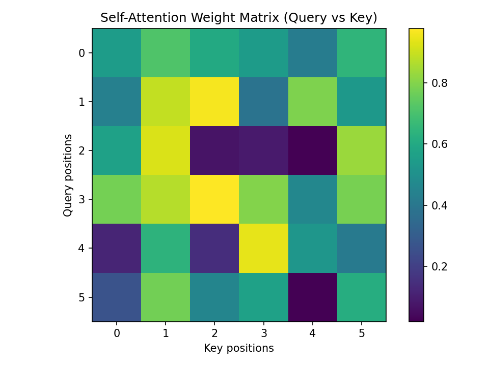
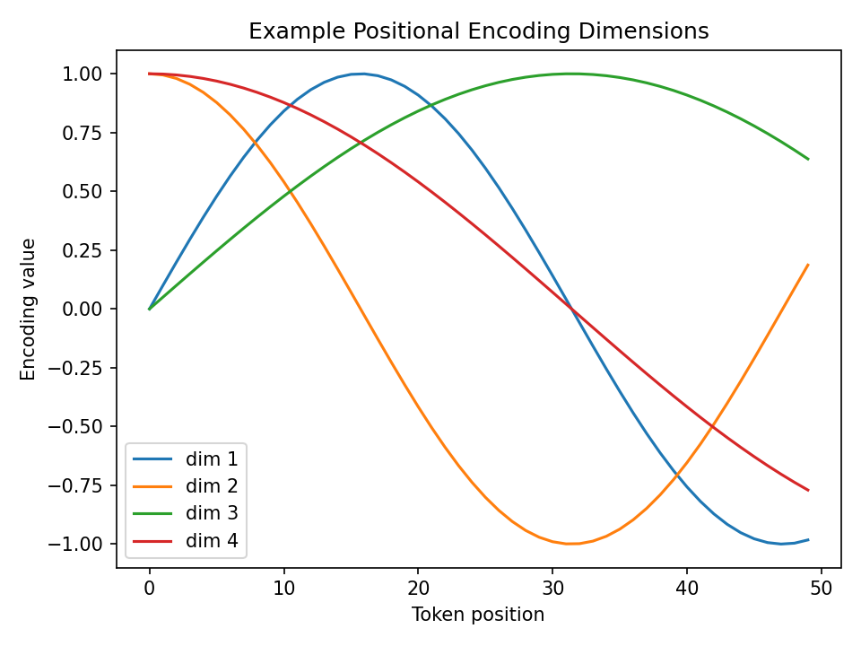

# Transformer Neural Network and Its Applications in Cybersecurity

## 1. Introduction

The Transformer is a modern neural network architecture designed to model sequential and structured data using an attention-based mechanism instead of recurrence or convolution. Originally introduced for natural language processing, the Transformer has become a dominant architecture in many security‑related learning tasks because of its ability to model long‑range dependencies, contextual relationships and complex temporal patterns.

Unlike recurrent neural networks, which process tokens one by one, the Transformer processes the entire input sequence in parallel. This property enables faster training and allows the model to capture global relationships between distant elements in a sequence, such as events occurring far apart in a network log, command sequence, or packet stream.

The core components of a Transformer layer are:

- multi‑head self‑attention,
- position‑wise feed‑forward networks,
- residual connections and layer normalization,
- positional encoding.

Together, these components enable the model to learn both *what* elements are important and *how* their positions and relationships influence the final prediction.

---

## 2. Self‑Attention Mechanism

The self‑attention layer computes interactions between all tokens in an input sequence. For each token, three vectors are created: a query (Q), a key (K) and a value (V). The attention score between two tokens is obtained by comparing their query and key vectors and then using the resulting weight to combine the corresponding value vectors.

Mathematically, scaled dot‑product attention is defined as:

Attention(Q, K, V) = softmax(QKᵀ / √dₖ) · V

This mechanism allows the model to dynamically focus on the most relevant tokens for each position in the sequence.

### Visualization – Attention Layer

The figure shows a self‑attention weight matrix, where each row corresponds to a query token and each column corresponds to a key token. Higher values indicate stronger influence between tokens.

---

## 3. Positional Encoding

Because the Transformer does not use recurrence or convolution, it has no built‑in notion of token order. Positional encoding is therefore added to the input embeddings to inject information about the position of each token in the sequence.

A commonly used approach is sinusoidal positional encoding:

PE(pos, 2i)   = sin(pos / 10000^(2i / d))

PE(pos, 2i+1) = cos(pos / 10000^(2i / d))

This formulation allows the model to learn relative and absolute positions and generalize to longer sequences.

### Visualization – Positional Encoding

The curves illustrate several dimensions of the positional encoding across token positions.

---

## 4. Transformer Architecture

A typical Transformer encoder layer consists of a multi‑head self‑attention block followed by a feed‑forward neural network. Multi‑head attention enables the model to attend to different representation subspaces simultaneously, capturing various types of relationships such as temporal proximity, protocol patterns, or command dependencies.

Stacking multiple encoder layers results in a deep contextual representation that is well suited for complex sequence modeling tasks.

---

## 5. Applications of Transformers in Cybersecurity

Transformers are increasingly used in cybersecurity because many security problems naturally involve sequences and contextual dependencies. Typical applications include:

- intrusion detection based on sequences of packets or flows,
- malware detection from opcode or API call sequences,
- log analysis and anomaly detection in large‑scale systems,
- phishing and social engineering detection using message content and metadata,
- user and entity behavior analytics.

For example, in a network intrusion detection system, a Transformer can process a sequence of network events (such as flow records or packet features) and learn temporal attack signatures that span long time intervals. Unlike traditional feature‑based classifiers, the Transformer can automatically learn which events and which time relationships are critical for detecting attacks such as lateral movement, command‑and‑control communication, or data exfiltration.

---

## 6. Practical Cybersecurity Example

Consider a dataset where each sample is a sequence of network flows represented by feature vectors (packet count, average packet size, inter‑arrival time and protocol flags). A Transformer encoder can be trained to classify each sequence as benign or malicious. The self‑attention mechanism allows the model to focus on suspicious flow segments, such as bursts of encrypted traffic or periodic beaconing patterns that often indicate command‑and‑control activity.

By modeling long‑range dependencies and complex correlations between events, Transformer‑based systems significantly improve detection performance in modern, encrypted and high‑volume networks, where handcrafted features and short‑window models are no longer sufficient.

---

## 7. Summary

The Transformer network replaces recurrence and convolution with attention‑based modeling, enabling highly expressive and scalable learning for sequential data. Its self‑attention mechanism and positional encoding make it especially suitable for cybersecurity problems that require understanding long‑term behavioral patterns, contextual relationships between events and evolving attack strategies.

